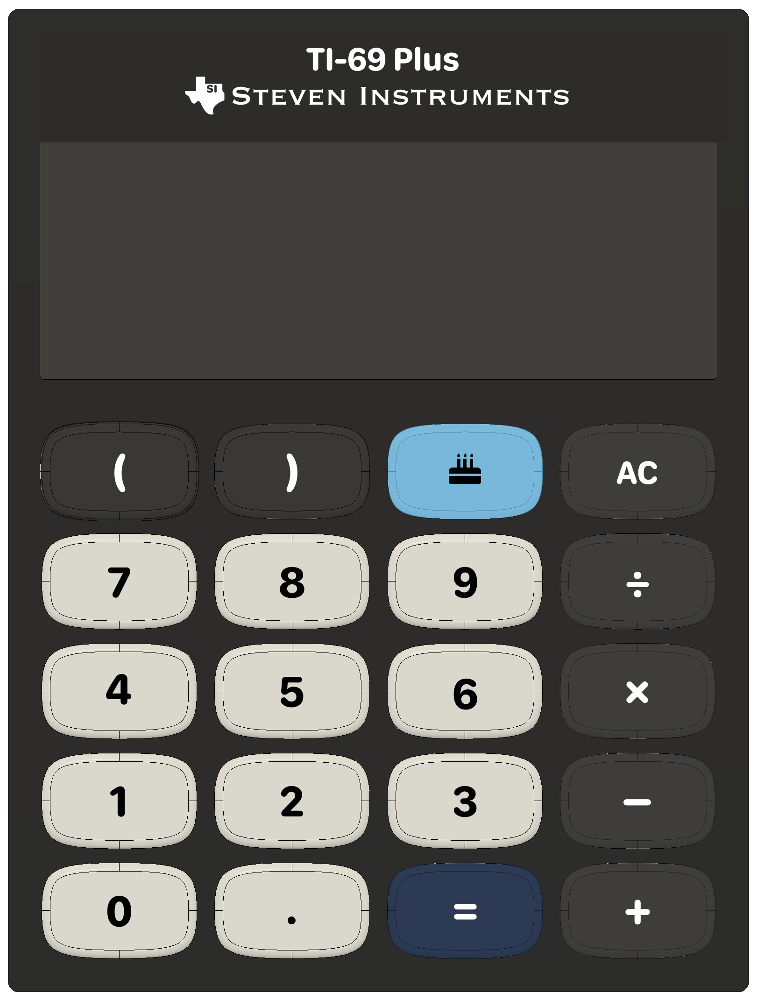

# Calculator Costume

This is the code for a human-sized calculator costume. It parses expressions using a modified version of the Shunting-Yard algorithm (modified to handle missing parens and multiplying adjacent operands by default).

It controls 2 16×16 LED matrix displays and receives input from a 5×4 matrix keypad. It uses FastLED to control the LED matrix, and Keypad to handle input from the keypad.

<!-- Image of calculator -->

